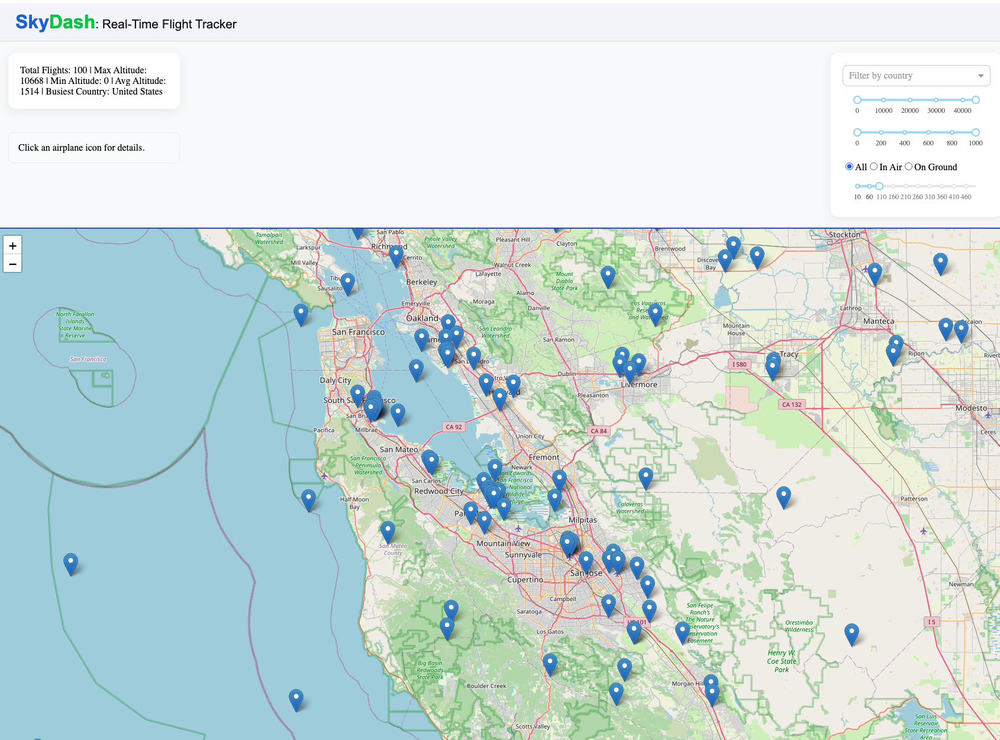

# SkyDash

A real-time, interactive flight tracker built with Dash, Dash Leaflet, and the OpenSky Network API.



## Features

- Live-updating map of flights (emoji airplane markers)
- Filter by country, altitude, speed, and flight status
- Dynamic summary and sidebar
- Responsive to map viewport and user controls

## Setup


1. Install dependencies with [uv](https://github.com/astral-sh/uv):
    ```sh
    uv pip install -r pyproject.toml
    ```
    or, if you want to create a virtual environment and install:
    ```sh
    uv venv .venv
    source .venv/bin/activate
    uv pip install -r pyproject.toml
    ```    

2. Run the app:
    ```sh
    python src/app.py
    ```

3. Open your browser to [http://127.0.0.1:8050](http://127.0.0.1:8050)

## Configuration

- Edit [src/config.py](cci:7://file:///Users/praveen/Documents/Code/RealTimeFlightTracker/src/config.py:0:0-0:0) to change bounding boxes, refresh intervals, or default country.

## Project Structure
```
SkyDash/
├── assets/
│   └── airplane.png
├── src/
│   ├── app.py
│   ├── callbacks.py
│   ├── config.py
│   ├── layout.py
│   ├── map_plot.py
│   ├── opensky_data.py
│   └── dash_app.py
├── README.md
├── FUTURE.md
├── pyproject.toml
└── ...
```


## Roadmap

See [FUTURE.md](FUTURE.md) for planned features and ideas.

## Notes

- The app uses the free OpenSky API, which is rate-limited. If you see a rate limit warning, wait a few minutes before retrying.
- For custom icons, upgrade dash-leaflet and use PNG/SVG in `assets/`.

---